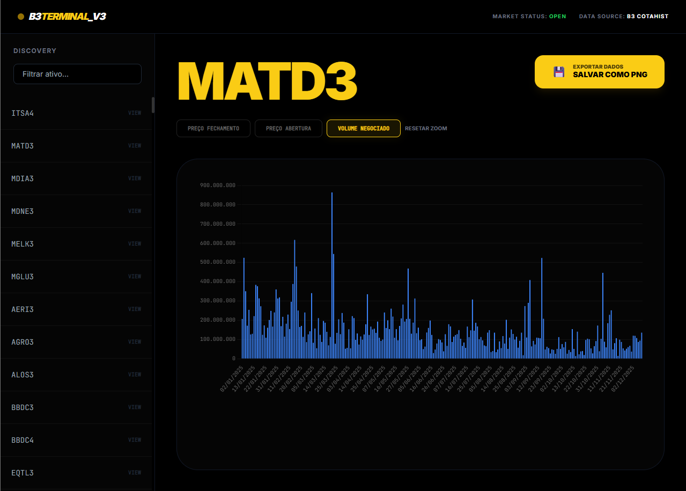

# 📊 B3 Terminal | Market Intelligence

Plataforma **full-stack** para processamento de arquivos **COTAHIST (B3)** e visualização de métricas financeiras em um dashboard interativo.



---

## 🎯 Visão Geral

- Processa dados históricos da B3 (ETL)
- Aplica filtros de mercado configuráveis
- Persiste dados em banco local
- Exibe gráficos interativos via dashboard

Tudo com **configuração centralizada** e execução simples.

---

## ⚙️ Configuração (Single Source of Truth)

Toda a infraestrutura e regras de negócio são definidas em **um único arquivo**: `.env`.

### 1. Crie o arquivo `.env` na raiz do projeto

```env
# Infraestrutura
DB_CONNECTION_STRING=sqlite:///database/b3_cotacoes.db
B3_FILE_PATH=dados/COTAHIST_A2024.TXT
API_PORT=8000

# Filtros de Mercado
MIN_VOLUME=100000000
ALLOWED_BDI=02,03
```

🚀 Execução
1. Preparar o ambiente

```Bash
pip install -r requirements.txt
```

2. Processar os dados (ETL)

Lê o arquivo configurado, aplica os filtros e popula o banco.

```Bash
python main.py
```

3. Iniciar o sistema

Sobe a API e libera o dashboard.

```Bash
python router.py
```

Acesso ao dashboard:
Abra o arquivo index.html (recomendado usar Live Server na porta 5500).

🕹️ Funcionalidades

- Zoom Interativo: Scroll ou seleção por arraste

- Indicadores Dinâmicos: Abertura, fechamento e volume

- Exportação: Salve o gráfico como PNG mantendo filtros e zoom

- Busca Rápida: Localização instantânea de ativos

🧪 Testes

O projeto utiliza Pytest para testes de unidade e integração.

```Bash
pytest -v
```

📂 Estrutura do Projeto

```text
/core        # Configurações e regras de negócio
/services    # Processamento de dados e gráficos
/api         # Endpoints FastAPI
/tests       # Testes automatizados
/database    # Persistência SQLite
```

✅ Boas Práticas Adotadas

- Configuração centralizada via .env

- Separação clara de responsabilidades

- Código orientado a serviços

- Testes automatizados desde a base

- Foco em execução simples e objetiva